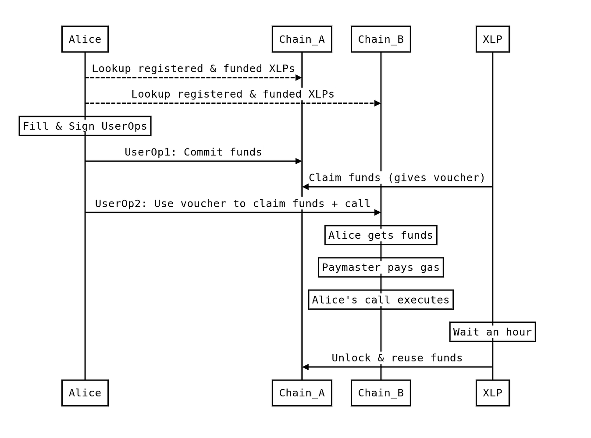

# 🔗 Cross-Chain (WeissChannels)

!!! info "Testnet Preview"
    WeissChannels is currently deployed on **testnet** and under active development. The protocol and SDK APIs may change before mainnet launch.

## Single-signature atomic execution across multiple chains.

**WeissChannels** is a protocol extension for ERC-4337 Smart Accounts that enables single-signature, atomic, cross-chain execution without custodial intermediaries.

---

## 🔧 What Do WeissChannels Do?

WeissChannels enable users to:

- **Sign once, execute everywhere** — A single Merkle root signature authorizes operations across multiple L2 chains
- **Control their own execution** — Users execute transactions on destination chains, not third-party solvers
- **Move assets atomically** — Either the cross-chain swap completes, or funds are returned
- **Pay fees in any asset** — Gas abstraction works across chains via CrossChainPaymasters

---

## 🧪 How Does It Work?

1. **User signs a Merkle root** covering operations on multiple chains
2. **User locks assets** on the source chain via the CrossChainPaymaster
3. **XLP (Crosschain Liquidity Provider)** issues a voucher committing to provide funds on the destination
4. **User executes** on the destination chain, consuming the voucher
5. **XLP claims** the locked funds on the source chain

---

## 🏗️ Key Components

| Component | Role |
|-----------|------|
| **CrossChainPaymaster** | Deployed on each L2 to manage locks, vouchers, and settlements |
| **L1 Stake Manager** | Holds XLP security stakes on Ethereum Mainnet for dispute resolution |
| **XLPs** | Permissionless market makers who front liquidity and gas |
| **Multichain UserOps** | Merkle tree of operations signed with a single signature |

---

## 🔒 Security Model

WeissChannels use an **Optimistic Rollup security model** with a **1-of-N honest assumption**:

- The system is secure as long as ONE honest actor submits fraud proofs
- Users never lose funds — worst case is a temporary lock until expiration
- XLPs stake on L1 and can be slashed for misbehavior
- Ethereum L1 acts as the "Supreme Court" for disputes

---

## 📚 In This Section

- [Overview](overview.md) — What WeissChannels solve and why
- [Architecture](architecture.md) — Data structures, participants, and lifecycle
- [Contracts](contracts.md) — CrossChainPaymaster and L1StakeManager interfaces
- [SDK](sdk.md) — TypeScript SDK for building cross-chain operations
- [Fees & Economics](fees-and-economics.md) — Reverse Dutch auction and XLP incentives
- [Security](security.md) — Trust model, dispute resolution, and attack mitigations
- [Whitepaper](whitepaper.md) — Full technical whitepaper reference

---

## ✅ Summary

WeissChannels restore the seamless experience of a single chain while preserving Ethereum's core guarantees: censorship resistance, self-custody, and disintermediation. Built on [ERC-4337](../core-standards/erc-4337.md), they extend [Smart Accounts](../smart-accounts/README.md) with native cross-chain capabilities using [Paymasters](../paymasters/README.md) for gas abstraction.

