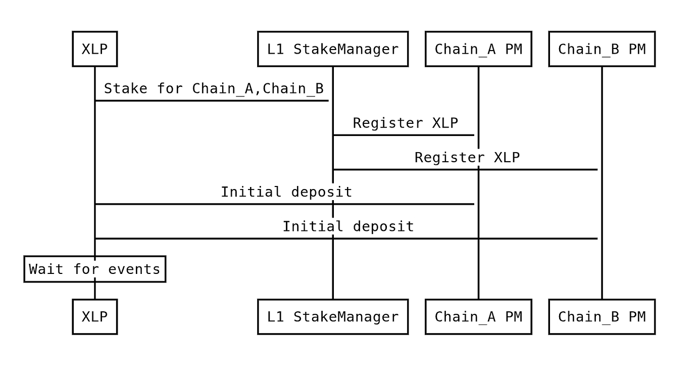
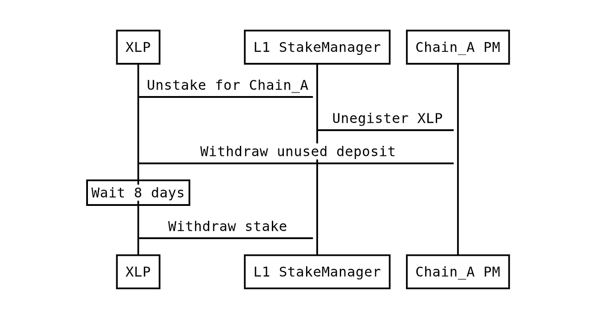
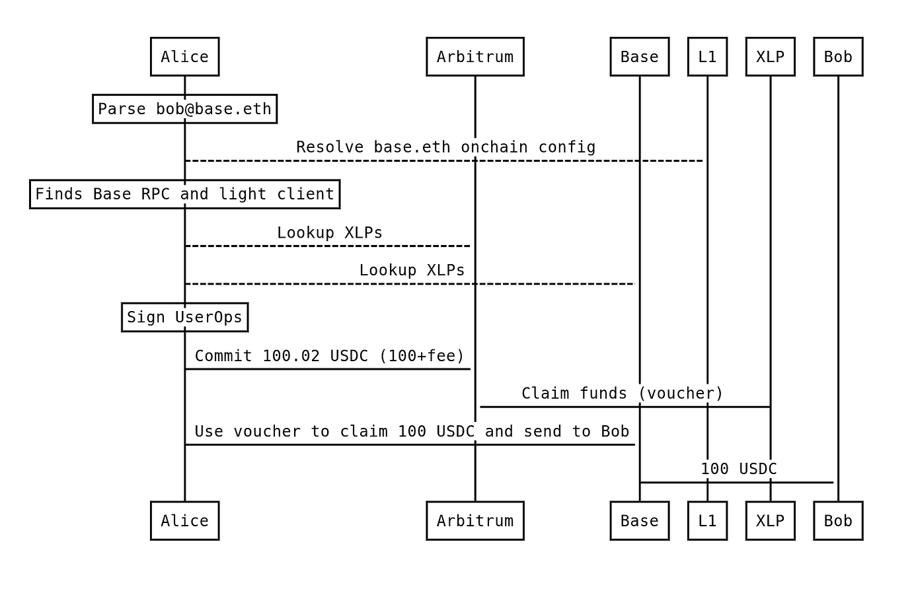
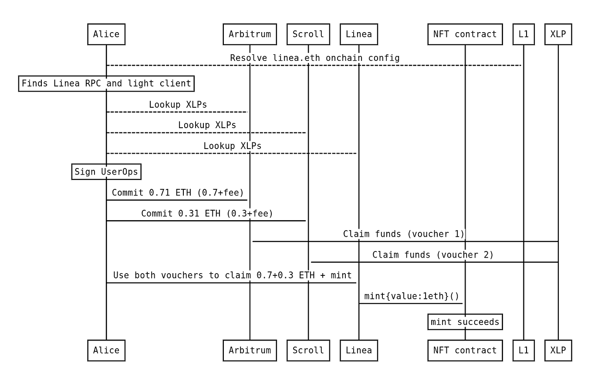
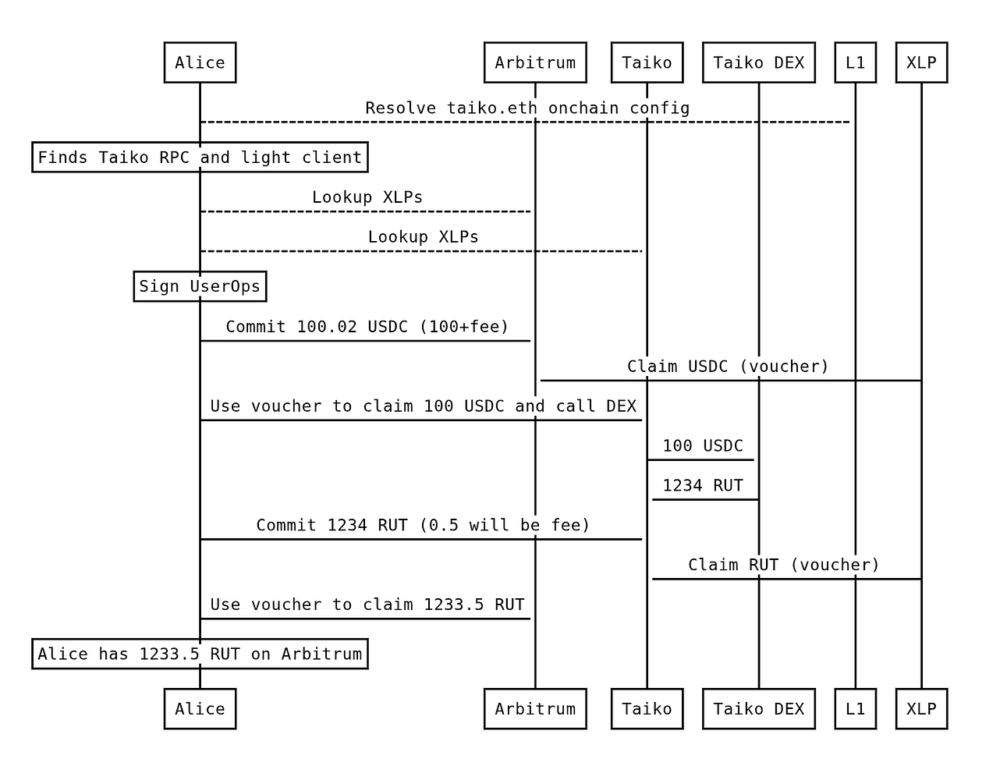

# Architecture

## Data structures, participants, and the protocol lifecycle.

This page describes how WeissChannels work under the hood, including the key data structures, protocol participants, and the step-by-step transaction lifecycle.

---

## 🔧 Core Concepts

### The "Just-In-Time" Paradigm

Unlike traditional state channels (e.g., the Lightning Network) which are long-lived, bilateral, and require pre-funding, a WeissChannel is **multilateral and ad-hoc**. It is spun up for exactly one transaction sequence and then immediately dissolves.

This avoids the capital inefficiency of locking funds in channels that may sit idle. Instead, liquidity is sourced dynamically from a permissionless pool of **Crosschain Liquidity Providers (XLPs)**.

### Layer 1 as the "Supreme Court"

The protocol adheres to the **Optimistic security model**. Ethereum Mainnet (L1) is never used for transaction execution, which would be too slow and expensive. Instead, L1 acts strictly as the judiciary:

- Holds security stakes from XLPs
- Processes dispute proofs only when a counterparty acts maliciously
- The normal case operates at L2 speed
- The worst case retains L1 security

### Account-Based vs. Messaging-Based

WeissChannels are explicitly **account-based**, not messaging-based:

| Type | What It Enables |
|------|-----------------|
| **Account-Based (WeissChannels)** | A *user* controls assets and executes calls on multiple chains |
| **Messaging-Based (Bridges)** | A *contract* on Chain A calls a *contract* on Chain B |

WeissChannels do not attempt to enable generic contract-to-contract composability. For use cases where a contract needs to trigger an action remotely without a user present, trust-minimized messaging bridges are still required.

---

## 👥 Protocol Participants

| Participant | Role |
|-------------|------|
| **User (Alice)** | Initiates the transaction; signs a Merkle root authorizing operations across chains |
| **XLP (Crosschain Liquidity Provider)** | Permissionless market maker who fronts liquidity and gas, earning fees in return |
| **CrossChainPaymaster** | Contracts deployed on every supported L2 that manage asset locking, voucher verification, and settlements |
| **L1 Stake Manager** | The "Judge" contract on Ethereum Mainnet holding XLP penalty stakes and processing disputes |

---

## 📦 Data Structures

### Multichain UserOp

To enable single-signature cross-chain execution, the user signs a Merkle root of a tree containing operations for multiple chains.

Each leaf in the Merkle tree represents a chain-specific operation:

```solidity
struct ChainUserOp {
    address sender;       // Smart Account address
    uint256 nonce;        // Account nonce on this specific chain
    bytes callData;       // Encoded call to execute
    uint256 callGasLimit; // Gas limit for the call execution
    uint256 chainId;      // Target chain identifier
}
```

The user signs the Merkle root `R`. For each chain, the Smart Account's `validateUserOp` function verifies the Merkle proof for the chain-specific operation.


### Asset

An `Asset` represents a token and amount pair:

```solidity
struct Asset {
    address erc20Token;  // Token address (or NATIVE_ETH sentinel)
    uint256 amount;      // Amount of tokens
}
```

### AtomicSwapVoucherRequest

The complete voucher request combining source and destination components:

```solidity
struct AtomicSwapVoucherRequest {
    SourceSwapComponent origination;      // Source chain parameters
    DestinationSwapComponent destination; // Destination chain parameters
}
```

### AtomicSwapVoucher

An XLP's signed commitment to provide funds on the destination chain:

```solidity
struct AtomicSwapVoucher {
    bytes32 requestId;                        // Hash of the request
    address payable originationXlpAddress;    // XLP providing the voucher
    DestinationSwapComponent voucherRequestDest;
    uint256 expiresAt;                        // When voucher expires
    VoucherType voucherType;
    bytes xlpSignature;                       // XLP's EIP-191 signature
}
```

---

## 🔄 Protocol Lifecycle

The WeissChannel protocol replaces traditional Hash Time Locked Contracts (HTLC) with an optimistic design, reducing the number of transactions on the destination chain to zero (via piggybacking on the user's UserOp).


### Step 1: Registration & Staking

XLPs register by depositing funds in the `CrossChainPaymaster` on various L2s. They must also lock a security stake in the `L1StakeManager` on Ethereum Mainnet.



- **Unstake Delay:** 8 days (longer than maximum L2 finality)
- **Immediate Unregistration:** If an XLP initiates unstake, they are immediately removed from the active set



### Step 2: Commitment (Source Chain)

The user broadcasts a `UserOp` on the Source Chain. This operation locks their assets (e.g., 100 USDC) in the `CrossChainPaymaster`.

- **Fee Schedule:** User specifies a list of XLPs and a fee schedule (reverse Dutch auction)
- **Short-Lived Lock:** Request has a short expiration; funds auto-unlock if no voucher is provided

### Step 3: Voucher Issuance (Off-Chain)

An XLP observes the lock event. If profitable, they sign a **Voucher** — a cryptographic commitment to provide the requested funds/gas on the destination chain.

Multiple XLPs can issue vouchers simultaneously, creating competition and ensuring users get the best rates.

### Step 4: Execution (Destination Chain)

The user appends the XLP's voucher to their destination chain UserOp and submits it.

- **Zero-Overhead Claiming:** The XLP does not submit a separate transaction
- **Atomic Swap:** The Paymaster validates the voucher during UserOp validation
- **Execution:** The user's transaction executes (e.g., buying an NFT)

### Step 5: Settlement (Source Chain)

The XLP claims the user's locked funds on the source chain by providing the signed voucher.

- **Anti-Rugpull Lock:** Funds remain locked briefly for dispute resolution

### Step 6: Completion Call (Optional)

The protocol can perform a **Completion Call** back to the source chain, enabling:

- Bridging assets out for yield farming and bridging receipt tokens back
- Executing a swap on a remote DEX and returning the swapped tokens
- Aggregating liquidity from multiple chains into one destination

---

## 🔀 Multi-Leg Transactions

WeissChannels support transactions spanning more than two chains:

| Pattern | Description |
|---------|-------------|
| **Sequential** | Chain A → Chain B → Chain C |
| **Fan-Out** | Chain A → (Chain B, Chain C, Chain D) simultaneously |
| **Round-Trip** | Chain A → Chain B → Chain A (completion call) |

### Example: Seamless Cross-Chain Transfer



### Example: Aggregating Liquidity



### Example: Cross-Chain Swap



---

## 🔗 Related Pages

- [Contracts](contracts.md) — CrossChainPaymaster and L1StakeManager interfaces
- [Fees & Economics](fees-and-economics.md) — How the reverse Dutch auction works
- [Security](security.md) — Dispute resolution and attack mitigations

